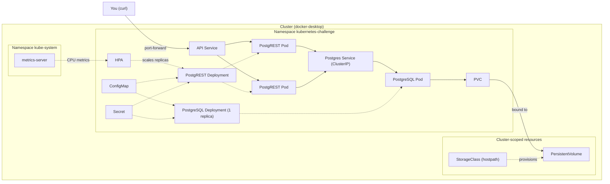

# Kubernetes Challenge — Fundamentals in Practice

Deploy a REST API (PostgREST) backed by a PostgreSQL database on a local Kubernetes cluster, and prove that the data survives when the database Pod is destroyed.

Everything is declared in versioned YAML manifests: namespace, persistent storage, ConfigMap/Secret, health checks, resource limits and autoscaling (HPA).

## Architecture



Solid arrows are traffic or data; dashed arrows mean "manages", "configures" or "feeds".

The diagram has three layers:

- **Outside the cluster:** you, calling the API with `curl`.
- **Cluster-scoped resources:** the StorageClass and the PersistentVolume belong to no namespace. The PVC is the *request* for storage and lives in the namespace. The PV is the actual volume. The StorageClass is what created that PV on demand.
- **Namespaced resources:** everything the challenge deploys, isolated in `kubernetes-challenge`. The exception is metrics-server, which lives in `kube-system`.

ConfigMap and Secret point to the **Deployments** because the injection is declared in the Pod template, so every replica receives it.

The API reaches the database by the **name of the Postgres Service** (cluster DNS), never by Pod IP. Pods can be recreated and change IP; the Service name stays the same.

## Stack

| Component | Role |
|---|---|
| **Docker Desktop** (built-in Kubernetes) | Local single-node cluster, zero cost |
| **kubectl** | CLI that talks to the cluster API |
| **PostgreSQL** | Relational database, the *stateful* part |
| **PostgREST** | Generates a REST API from the Postgres schema, the *stateless* part |
| **metrics-server** | CPU/memory metrics for the HPA |
| **GitHub Actions** | CI: secret leak scan, credential checks and manifest validation |

### Kubernetes as a restaurant

- **Cluster / control plane**: management decides; the **node** is the kitchen that executes.
- **Namespace**: a reserved area of the dining room just for your event.
- **Pod**: a cook at work.
- **Deployment**: the manager who guarantees X cooks per shift; if one leaves, another is called in.
- **Service**: the kitchen's fixed phone extension. The waiter dials the extension, no matter which cook is on duty.
- **PVC**: the locked pantry. The ingredients stay there even when the cook goes home.
- **ConfigMap**: the menu on the wall, readable by anyone.
- **Secret**: the safe's combination written in another alphabet (Base64). It is not a real safe.
- **Probes**: the manager asking "are you alive?" and "are you ready to serve?".
- **HPA**: calling in extra cooks when the queue grows and sending them home when it empties.

## Levels

Each level was developed in its own branch and merged through a pull request.

- [x] **Level 0 — Prerequisites:** local cluster responding, node `Ready`
- [x] **Level 1 — Namespace and first Pod:** prove that a bare Pod does not come back by itself
- [x] **Level 2 — PostgreSQL with persistence:** Deployment + PVC + ClusterIP Service
- [x] **Level 3 — ConfigMap and Secret:** configuration and credentials out of the Deployment manifest
- [x] **Level 4 — PostgREST + PostgreSQL:** API connected to the database by Service name
- [x] **Level 5 — External access and persistence proof:** POST → delete DB Pod → same data on GET
- [x] **Level 6 — Health checks, resources and scaling:** probes, requests/limits, multiple API replicas
- [ ] **Level 7 — HPA (bonus):** replicas scaling up and down with CPU load

**Out of scope, on purpose:** Ingress, StatefulSet, Helm, cloud clusters, CD, TLS, database backups and JWT auth in PostgREST.

---

## Level 0 — Prerequisites

**Cluster tool:** Docker Desktop, with Kubernetes enabled in *Settings → Kubernetes → Enable Kubernetes*.

```bash
$ kubectl config current-context   
docker-desktop

$ kubectl get nodes 
NAME             STATUS   ROLES           AGE   VERSION
docker-desktop   Ready    control-plane   9h    v1.34.1              
```

## Level 1 — Namespace and first Pod

Every resource of the challenge lives in its own namespace, [`k8s/00-namespace.yaml`](k8s/00-namespace.yaml). A bare Pod ([`k8s/extras/test-pod.yaml`](k8s/extras/test-pod.yaml)) was created, inspected and deleted.

```bash
kubectl apply -f k8s/00-namespace.yaml
kubectl apply -f k8s/extras/test-pod.yaml
kubectl get pods -n kubernetes-challenge -o wide
kubectl describe pod test-pod -n kubernetes-challenge
kubectl logs test-pod -n kubernetes-challenge
kubectl delete pod test-pod -n kubernetes-challenge
```

```text
$ kubectl delete pod test-pod -n kubernetes-challenge
pod "test-pod" deleted from kubernetes-challenge namespace

$ kubectl get pods -n kubernetes-challenge
No resources found in kubernetes-challenge namespace.
```

Full outputs: [get](docs/evidence/level-1/01-get.txt) · [describe](docs/evidence/level-1/02-describe.txt) · [logs](docs/evidence/level-1/03-logs.txt) · [delete](docs/evidence/level-1/04-delete.txt)

> **Takeaway:** a bare Pod has no owner, so nothing recreates it. That's why workloads run under a Deployment, whose ReplicaSet recreates missing Pods.
>
> `k8s/extras/` is skipped by `kubectl apply -f k8s/` (not recursive). The test Pod is not part of the stack.

## Level 2 — PostgreSQL with persistence

| File | What it does |
|---|---|
| [`k8s/02-postgres-pvc.yaml`](k8s/02-postgres-pvc.yaml) | Requests 1Gi of storage (`ReadWriteOnce`). The default StorageClass (`hostpath`) provisions a PV for it on demand. |
| [`k8s/03-postgres-deployment.yaml`](k8s/03-postgres-deployment.yaml) | `postgres:16-alpine`, 1 replica, the PVC mounted at `/var/lib/postgresql/data`. Strategy `Recreate`, so two Pods never fight over the same volume. |
| [`k8s/04-postgres-service.yaml`](k8s/04-postgres-service.yaml) | ClusterIP Service `postgres`: a stable name and IP in front of the Pod. |
| [`scripts/create-secret.sh`](scripts/create-secret.sh) | Creates the `postgres-secret` Secret from a local `.env` file. |

The credentials never touch a versioned file. `.env` is git-ignored, and [`.env.example`](.env.example) is the template. The Deployment only references the Secret through `secretKeyRef`. CI fails the build if a manifest contains a literal password or a `kind: Secret`.

```bash
cp .env.example .env               # then set a real password with openssl rand -hex 16
./scripts/create-secret.sh
kubectl apply -f k8s/
kubectl rollout status deploy/postgres -n kubernetes-challenge
```

The PVC is `Bound` to a PV that the StorageClass created:

```text
NAME           STATUS   VOLUME                                     CAPACITY   ACCESS MODES   STORAGECLASS
postgres-pvc   Bound    pvc-447516d8-af91-420c-b769-aaf093dc0c0d   1Gi        RWO            hostpath
```

And the database answers through the Service DNS name `postgres.kubernetes-challenge.svc.cluster.local`:

```text
 current_user | current_database | inet_server_addr |  version
--------------+------------------+------------------+----------------------------------
 app          | challenge        | 10.1.0.20        | PostgreSQL 16.15 on x86_64-pc-...
```

Full outputs: [PVC and PV](docs/evidence/level-2/01-pvc-pv.txt) · [resources](docs/evidence/level-2/02-resources.txt) · [connection via Service](docs/evidence/level-2/03-connect-via-service.txt)

> **Takeaway:** an `emptyDir` is deleted with its Pod. A PVC outlives the Pod, and the next Pod mounts the same data. `PGDATA` is a subfolder because `initdb` needs an empty directory, and a new volume may contain `lost+found`.

## Level 3 — ConfigMap and Secret

The Deployment manifest no longer contains any configuration values. It only references where they come from:

| Source | Keys | Why there |
|---|---|---|
| ConfigMap [`app-config`](k8s/01-configmap.yaml) | `POSTGRES_DB`, `PGDATA` | Not sensitive, safe to version |
| Secret `postgres-secret` (from `.env`) | `POSTGRES_USER`, `POSTGRES_PASSWORD` | Credentials, never versioned |

```yaml
- name: POSTGRES_PASSWORD
  valueFrom:
    secretKeyRef:
      name: postgres-secret
      key: POSTGRES_PASSWORD
- name: POSTGRES_DB
  valueFrom:
    configMapKeyRef:
      name: app-config
      key: POSTGRES_DB
```

Inside the Pod, the variables arrive as plain environment variables:

```text
POSTGRES_USER=app
POSTGRES_DB=challenge
PGDATA=/var/lib/postgresql/data/pgdata
```

Full outputs: [ConfigMap](docs/evidence/level-3/01-configmap.txt) · [Secret](docs/evidence/level-3/02-secret.txt) · [env in the Pod](docs/evidence/level-3/03-env-in-pod.txt)

> **Takeaway:** a Secret is only Base64-encoded, not encrypted (`echo YXBw | base64 -d` → `app`). Real protection comes from RBAC, encryption at rest and keeping it out of git.

## Level 4 — PostgREST + PostgreSQL

| File | What it does |
|---|---|
| [`sql/init.sql`](sql/init.sql) | Creates schema `api`, table `api.tasks`, the anonymous role `web_anon` with `SELECT`/`INSERT`, and one seed row. Idempotent. |
| [`k8s/01-configmap.yaml`](k8s/01-configmap.yaml) | Adds `DB_HOST: postgres` (the Service name) and the PostgREST settings. |
| [`k8s/05-postgrest-deployment.yaml`](k8s/05-postgrest-deployment.yaml) | `postgrest/postgrest:v12.2.3`, reusing the same Secret as the database. |
| [`k8s/06-postgrest-service.yaml`](k8s/06-postgrest-service.yaml) | ClusterIP Service `postgrest` on port 3000. |

The connection string is assembled by Kubernetes from the other variables, so the password is never written in the manifest:

```yaml
- name: PGRST_DB_URI
  value: postgres://$(POSTGRES_USER):$(POSTGRES_PASSWORD)@$(DB_HOST):5432/$(POSTGRES_DB)
```

Create the table **before** starting the API. PostgREST loads its schema cache at startup:

```bash
kubectl exec -i deploy/postgres -n kubernetes-challenge -- \
  sh -c 'psql -v ON_ERROR_STOP=1 -U "$POSTGRES_USER" -d "$POSTGRES_DB"' < sql/init.sql
kubectl apply -f k8s/
kubectl rollout status deploy/postgrest -n kubernetes-challenge
```

The logs show that the API found the database through the Service and loaded the table:

```text
Successfully connected to PostgreSQL 16.15 on x86_64-pc-linux-musl, ...
Schema cache loaded 1 Relations, 0 Relationships, 0 Functions, ...
```

```text
$ kubectl port-forward svc/postgrest 3000:3000 -n kubernetes-challenge   # other terminal
$ curl -s localhost:3000/tasks
[{"id":1,"title":"First task, inserted via SQL","done":false,"created_at":"2026-09-24T00:06:12.342752+00:00"}]
```

The request travels `curl → port-forward → Service postgrest → PostgREST Pod → Service postgres → Postgres Pod → PVC`.

Full outputs: [init.sql](docs/evidence/level-4/01-init-sql.txt) · [PostgREST logs](docs/evidence/level-4/02-postgrest-logs.txt) · [GET /tasks](docs/evidence/level-4/03-get-tasks.txt)

> **Takeaway:** a Pod's IP changes when it is recreated, and the Service name doesn't. Connecting by `postgres` keeps working no matter which Pod is behind it.

## Level 5 — External access and persistence proof

The API is exposed to the host with `kubectl port-forward`. The test: write through the API, destroy the database Pod, and read the same data back.

```bash
kubectl port-forward svc/postgrest 3000:3000 -n kubernetes-challenge   # terminal 1
kubectl get pods -n kubernetes-challenge -w                             # terminal 2
```

**1. Write and read through the API**

```text
$ curl -s -X POST localhost:3000/tasks -H "Content-Type: application/json" \
    -H "Prefer: return=representation" -d '{"title":"Created via POST - persistence proof"}'
[{"id":2,"title":"Created via POST - persistence proof","done":false,"created_at":"2026-09-24T00:07:41.838545+00:00"}]

$ curl -s localhost:3000/tasks
[{"id":1,"title":"First task, inserted via SQL","done":false,"created_at":"2026-09-24T00:06:12.342752+00:00"},
 {"id":2,"title":"Created via POST - persistence proof","done":false,"created_at":"2026-09-24T00:07:41.838545+00:00"}]
```

**2. Delete the database Pod**

```text
$ kubectl delete pod postgres-7bb585574f-p2wxk -n kubernetes-challenge
pod "postgres-7bb585574f-p2wxk" deleted from kubernetes-challenge namespace
```

The ReplicaSet notices "want 1, have 0" and creates a replacement right away:

```text
EVENT      NAME                         READY   STATUS              AGE
MODIFIED   postgres-7bb585574f-p2wxk    1/1     Terminating         2m46s
ADDED      postgres-7bb585574f-5x8xx    0/1     Pending             0s
MODIFIED   postgres-7bb585574f-5x8xx    0/1     ContainerCreating   0s
MODIFIED   postgres-7bb585574f-5x8xx    1/1     Running             2s
DELETED    postgres-7bb585574f-p2wxk    0/1     Completed           2m48s
```

The new Pod has a new name and IP (`10.1.0.21` → `10.1.0.23`). The Service keeps the same ClusterIP (`10.99.185.137`) and updates only its endpoint.

**3. Read again**

```text
$ curl -s localhost:3000/tasks
[{"id":1,"title":"First task, inserted via SQL","done":false,"created_at":"2026-09-24T00:06:12.342752+00:00"},
 {"id":2,"title":"Created via POST - persistence proof","done":false,"created_at":"2026-09-24T00:07:41.838545+00:00"}]
```

The row came back with the same `id` and `created_at` after the Pod was destroyed. ✅

Full outputs: [POST and GET before](docs/evidence/level-5/01-post-and-get-before.txt) · [delete](docs/evidence/level-5/02-delete-db-pod.txt) · [watch](docs/evidence/level-5/03-watch-pods.txt) · [new Pod and endpoints](docs/evidence/level-5/04-new-db-pod.txt) · [GET after](docs/evidence/level-5/05-get-after.txt)

> **Takeaway:** several pieces worked together. The ReplicaSet recreated the Pod, the PVC kept the data, the Service hid the IP change, and the Secret and ConfigMap gave the new Pod the same config. With an `emptyDir`, the second GET would return `[]`.

## Level 6 — Health checks, resources and scaling

| | PostgREST (3 replicas) | PostgreSQL (1 replica) |
|---|---|---|
| **Liveness** | `GET /live` on the admin port 3001 | `pg_isready`, 30s initial delay, 6 failures allowed |
| **Readiness** | `GET /ready` on port 3001 (DB connected, schema cache loaded) | `pg_isready` |
| **Requests** | 50m CPU / 64Mi | 100m CPU / 256Mi |
| **Limits** | 250m CPU / 128Mi | 500m CPU / 512Mi |

PostgREST exposes the health endpoints when `PGRST_ADMIN_SERVER_PORT` is set ([ConfigMap](k8s/01-configmap.yaml)). Probes are in [`k8s/05-postgrest-deployment.yaml`](k8s/05-postgrest-deployment.yaml) and [`k8s/03-postgres-deployment.yaml`](k8s/03-postgres-deployment.yaml).

**Load balancing:** 60 requests sent from inside the cluster to `http://postgrest:3000/tasks`, then counted in each replica's logs (`PGRST_LOG_LEVEL=info` logs every request):

```text
pod/postgrest-847c756c5c-6sl9n: 21
pod/postgrest-847c756c5c-77cr8: 25
pod/postgrest-847c756c5c-xsg9d: 14
```

Each request opened a new connection (`Connection: close`). kube-proxy balances **connections**, not requests, so a client with keep-alive, like `kubectl port-forward`, sticks to one Pod.

**Liveness vs readiness, in practice:** with the database scaled to 0, the API Pods stay alive, but readiness fails and the Service stops sending them traffic:

```text
$ kubectl scale deploy/postgres --replicas=0 -n kubernetes-challenge
NAME                         READY   STATUS    RESTARTS
postgrest-847c756c5c-6sl9n   0/1     Running   0
postgrest-847c756c5c-77cr8   0/1     Running   0
postgrest-847c756c5c-xsg9d   0/1     Running   0

10.1.0.27  ready=false        # endpoints of the postgrest Service
10.1.0.29  ready=false
10.1.0.30  ready=false

Warning  Unhealthy  kubelet  Readiness probe failed: HTTP probe failed with statuscode: 503
```

After scaling the database back to 1, all three return to `1/1` and `ready=true`, still with `RESTARTS 0`.

Full outputs: [probes and resources](docs/evidence/level-6/01-probes-and-resources.txt) · [load balancing](docs/evidence/level-6/02-load-balancing.txt) · [liveness vs readiness](docs/evidence/level-6/03-liveness-vs-readiness.txt)

> **Takeaway:** a failing liveness probe **restarts** the container, while a failing readiness probe only **removes the Pod from the Service**. The API is stateless, so it scales freely. Two Postgres Pods on the same PVC would corrupt the data, so scaling a database needs replication, not more replicas.
