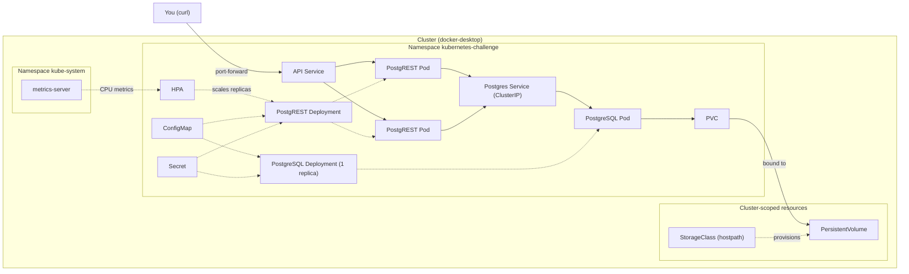
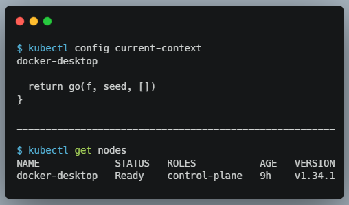

# Kubernetes Challenge — Fundamentals in Practice

Deploy a REST API (PostgREST) backed by a PostgreSQL database on a local Kubernetes cluster, and prove that the data survives when the database Pod is destroyed.

Everything is declared in versioned YAML manifests: namespace, persistent storage, ConfigMap/Secret, health checks, resource limits and autoscaling (HPA).

## Architecture



Solid arrows are traffic or data; dashed arrows mean "manages", "configures" or "feeds".

The diagram has three layers:

- **Outside the cluster:** you, calling the API with `curl`.
- **Cluster-scoped resources:** the StorageClass and the PersistentVolume belong to no namespace. The PVC is the *request* for storage and lives in the namespace. The PV is the actual volume. The StorageClass is what created that PV on demand.
- **Namespaced resources:** everything the challenge deploys, isolated in `kubernetes-challenge`. The exception is metrics-server, which lives in `kube-system`.

ConfigMap and Secret point to the **Deployments** because the injection is declared in the Pod template, so every replica receives it.

The API reaches the database by the **name of the Postgres Service** (cluster DNS), never by Pod IP. Pods can be recreated and change IP; the Service name stays the same.

## Stack

| Component | Role |
|---|---|
| **Docker Desktop** (built-in Kubernetes) | Local single-node cluster, zero cost |
| **kubectl** | CLI that talks to the cluster API |
| **PostgreSQL** | Relational database, the *stateful* part |
| **PostgREST** | Generates a REST API from the Postgres schema, the *stateless* part |
| **metrics-server** | CPU/memory metrics for the HPA |
| **GitHub Actions** | CI: secret leak scan, credential checks and manifest validation |

### Kubernetes as a restaurant

- **Cluster / control plane**: management decides; the **node** is the kitchen that executes.
- **Namespace**: a reserved area of the dining room just for your event.
- **Pod**: a cook at work.
- **Deployment**: the manager who guarantees X cooks per shift; if one leaves, another is called in.
- **Service**: the kitchen's fixed phone extension. The waiter dials the extension, no matter which cook is on duty.
- **PVC**: the locked pantry. The ingredients stay there even when the cook goes home.
- **ConfigMap**: the menu on the wall, readable by anyone.
- **Secret**: the safe's combination written in another alphabet (Base64). It is not a real safe.
- **Probes**: the manager asking "are you alive?" and "are you ready to serve?".
- **HPA**: calling in extra cooks when the queue grows and sending them home when it empties.

## Levels

Each level was developed in its own branch and merged through a pull request.

- [x] **Level 0 — Prerequisites:** local cluster responding, node `Ready`
- [x] **Level 1 — Namespace and first Pod:** prove that a bare Pod does not come back by itself
- [x] **Level 2 — PostgreSQL with persistence:** Deployment + PVC + ClusterIP Service
- [x] **Level 3 — ConfigMap and Secret:** configuration and credentials out of the Deployment manifest
- [ ] **Level 4 — PostgREST + PostgreSQL:** API connected to the database by Service name
- [ ] **Level 5 — External access and persistence proof:** POST → delete DB Pod → same data on GET
- [ ] **Level 6 — Health checks, resources and scaling:** probes, requests/limits, multiple API replicas
- [ ] **Level 7 — HPA (bonus):** replicas scaling up and down with CPU load

**Out of scope, on purpose:** Ingress, StatefulSet, Helm, cloud clusters, CD, TLS, database backups and JWT auth in PostgREST.

---

## Level 0 — Prerequisites

**Cluster tool:** Docker Desktop, with Kubernetes enabled in *Settings → Kubernetes → Enable Kubernetes*.

```bash
kubectl config current-context   # docker-desktop
kubectl get nodes                # STATUS must be Ready
```



## Level 1 — Namespace and first Pod

Every resource of the challenge lives in its own namespace, [`k8s/00-namespace.yaml`](k8s/00-namespace.yaml). A bare Pod ([`k8s/extras/test-pod.yaml`](k8s/extras/test-pod.yaml)) was created, inspected and deleted.

```bash
kubectl apply -f k8s/00-namespace.yaml
kubectl apply -f k8s/extras/test-pod.yaml
kubectl get pods -n kubernetes-challenge -o wide
kubectl describe pod test-pod -n kubernetes-challenge
kubectl logs test-pod -n kubernetes-challenge
kubectl delete pod test-pod -n kubernetes-challenge
```

```text
$ kubectl delete pod test-pod -n kubernetes-challenge
pod "test-pod" deleted from kubernetes-challenge namespace

$ kubectl get pods -n kubernetes-challenge
No resources found in kubernetes-challenge namespace.
```

Full outputs: [get](docs/evidence/level-1/01-get.txt) · [describe](docs/evidence/level-1/02-describe.txt) · [logs](docs/evidence/level-1/03-logs.txt) · [delete](docs/evidence/level-1/04-delete.txt)

**Does the deleted Pod come back by itself?** No. The Pod has no `ownerReferences`: no ReplicaSet is watching it, so nobody notices it is gone. That's why Pods are rarely created directly. A Deployment creates a ReplicaSet, which keeps comparing "desired" with "actual" and recreates missing Pods. Level 5 relies on exactly that.

> `k8s/extras/` is not applied by `kubectl apply -f k8s/`, because that command is not recursive. The test Pod is a one-off exercise, not part of the stack.

## Level 2 — PostgreSQL with persistence

| File | What it does |
|---|---|
| [`k8s/02-postgres-pvc.yaml`](k8s/02-postgres-pvc.yaml) | Requests 1Gi of storage (`ReadWriteOnce`). The default StorageClass (`hostpath`) provisions a PV for it on demand. |
| [`k8s/03-postgres-deployment.yaml`](k8s/03-postgres-deployment.yaml) | `postgres:16-alpine`, 1 replica, the PVC mounted at `/var/lib/postgresql/data`. Strategy `Recreate`, so two Pods never fight over the same volume. |
| [`k8s/04-postgres-service.yaml`](k8s/04-postgres-service.yaml) | ClusterIP Service `postgres`: a stable name and IP in front of the Pod. |
| [`scripts/create-secret.sh`](scripts/create-secret.sh) | Creates the `postgres-secret` Secret from a local `.env` file. |

The credentials never touch a versioned file. `.env` is git-ignored, and [`.env.example`](.env.example) is the template. The Deployment only references the Secret through `secretKeyRef`. CI fails the build if a manifest contains a literal password or a `kind: Secret`.

```bash
cp .env.example .env               # then set a real password: openssl rand -hex 16
./scripts/create-secret.sh
kubectl apply -f k8s/
kubectl rollout status deploy/postgres -n kubernetes-challenge
```

The PVC is `Bound` to a PV that the StorageClass created:

```text
NAME           STATUS   VOLUME                                     CAPACITY   ACCESS MODES   STORAGECLASS
postgres-pvc   Bound    pvc-447516d8-af91-420c-b769-aaf093dc0c0d   1Gi        RWO            hostpath
```

And the database answers through the Service DNS name `postgres.kubernetes-challenge.svc.cluster.local`:

```text
 current_user | current_database | inet_server_addr |  version
--------------+------------------+------------------+----------------------------------
 app          | challenge        | 10.1.0.20        | PostgreSQL 16.15 on x86_64-pc-...
```

Full outputs: [PVC and PV](docs/evidence/level-2/01-pvc-pv.txt) · [resources](docs/evidence/level-2/02-resources.txt) · [connection via Service](docs/evidence/level-2/03-connect-via-service.txt)

**PVC vs `emptyDir`:** an `emptyDir` is created with the Pod and deleted with it. It survives container restarts, but not Pod deletion. A PVC is a separate object with its own lifecycle: when the Pod is deleted, the claim and its PV remain, and the next Pod mounts the same data. Level 5 proves this.

`PGDATA` points to a subfolder (`.../data/pgdata`) because the root of a freshly mounted volume may contain `lost+found`, and `initdb` refuses to run in a non-empty directory.

## Level 3 — ConfigMap and Secret

The Deployment manifest no longer contains any configuration values. It only references where they come from:

| Source | Keys | Why there |
|---|---|---|
| ConfigMap [`app-config`](k8s/01-configmap.yaml) | `POSTGRES_DB`, `PGDATA` | Not sensitive, safe to version |
| Secret `postgres-secret` (from `.env`) | `POSTGRES_USER`, `POSTGRES_PASSWORD` | Credentials, never versioned |

```yaml
- name: POSTGRES_PASSWORD
  valueFrom:
    secretKeyRef:
      name: postgres-secret
      key: POSTGRES_PASSWORD
- name: POSTGRES_DB
  valueFrom:
    configMapKeyRef:
      name: app-config
      key: POSTGRES_DB
```

Inside the Pod, the variables arrive as plain environment variables:

```text
POSTGRES_USER=app
POSTGRES_DB=challenge
PGDATA=/var/lib/postgresql/data/pgdata
```

Full outputs: [ConfigMap](docs/evidence/level-3/01-configmap.txt) · [Secret](docs/evidence/level-3/02-secret.txt) · [env in the Pod](docs/evidence/level-3/03-env-in-pod.txt)

**Is the Secret encrypted?** No. The value in `kubectl get secret -o yaml` is only **Base64-encoded**, and anyone can reverse it:

```text
$ kubectl get secret postgres-secret -n kubernetes-challenge -o jsonpath="{.data.POSTGRES_USER}" | base64 -d
app
```

The real protection comes from elsewhere: RBAC limits who can `get` Secrets, and encryption at rest in etcd has to be enabled on the cluster. Also keep the Secret out of git, which is why this repo has no Secret manifest. In production, tools such as Sealed Secrets, External Secrets or a cloud secret manager fill this gap.
